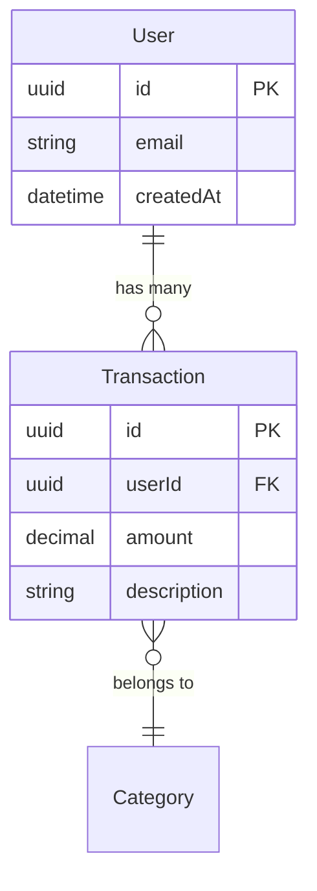

# Documentation Update Skill

Automatically update relevant documentation when changes are made to the codebase. This skill maps code changes to their corresponding documentation files.

## When to Use

Use this skill when:
- User asks to "update docs" or "update documentation"
- User mentions they changed the API and need to update openapi.yaml
- User mentions they changed the database schema and need to update ERD
- User mentions changes to business logic, agents, or observability
- User adds a new feature or capability to the system
- User modifies FAQ content or Playground tips
- User asks what docs need updating after a change
- User wants to regenerate ERD diagram

## Documentation Mapping

| Change Type | Files to Update | Commands |
|-------------|-----------------|----------|
| API endpoints | `docs/API/openapi.yaml` | Manual edit |
| Database schema | `prisma/schema.prisma`, `docs/SCHEMA/ERD.md`, `docs/SCHEMA/ERD.png` | See ERD section |
| Business logic | `docs/BUSINESS_LOGIC.md` | Manual edit |
| Agent behavior | `docs/AGENTS/*.md` | Manual edit |
| **User-facing features** | `docs/FEATURES.md`, `src/i18n/locales/en.ts`, `src/i18n/locales/pt.ts`, `src/playground/web/integration.html` | See Features section |
| Deployment config | `docs/DEPLOYMENT.md`, `.env.example` | Manual edit |
| Environment variables | `.env.example` | Manual edit |
| Observability | `docs/OBSERVABILITY.md` | Manual edit |
| Runbook-worthy issues | `docs/RUNBOOKS/*.md` | Manual edit |
| Services | `docs/SERVICES/*.md` | Manual edit |
| **New doc files** | `docs/_sidebar.md`, `docs/README.md` | See Docsify Sidebar section |

## Operations

### 1. Update OpenAPI Specification

When API endpoints change (new routes, modified request/response schemas):

```bash
# Location
docs/API/openapi.yaml
```

**What to update:**
- Add new paths under `paths:`
- Update request body schemas under `components/schemas`
- Update response schemas
- Add new security requirements if needed
- Update tags for grouping

**Example new endpoint:**
```yaml
paths:
  /v1/new-endpoint:
    post:
      tags:
        - feature
      summary: Description of endpoint
      operationId: createSomething
      requestBody:
        required: true
        content:
          application/json:
            schema:
              $ref: '#/components/schemas/CreateSomethingRequest'
      responses:
        '200':
          description: Success
          content:
            application/json:
              schema:
                $ref: '#/components/schemas/CreateSomethingResponse'
```

### 2. Update Database ERD

When `prisma/schema.prisma` changes (new models, relations, fields):

**Step 1: Update ERD.md**

Edit `docs/SCHEMA/ERD.md` to match the new schema. Use Mermaid erDiagram syntax:



**Step 2: Regenerate ERD.png**

```bash
# Install mermaid-cli if not installed
npm i -g @mermaid-js/mermaid-cli

# Generate PNG with 5x scale for readability
mmdc -i docs/SCHEMA/ERD.md -o docs/SCHEMA/ERD.png -s 5

# Verify the file was created
ls -la docs/SCHEMA/ERD.png
```

**Note:** The `-s 5` flag sets 5x scale for better readability in documentation.

### 3. Update Business Logic Documentation

When business rules change (validation, detection algorithms, thresholds):

**File:** `docs/BUSINESS_LOGIC.md`

**Sections to consider:**
- Currency Detection (7-level waterfall)
- Date Detection (NLP → Default strategy)
- Duplicate Detection (5-minute window)
- Category Taxonomy (2-level hierarchy)
- Payment Methods & Banks
- Counterparty Matching

### 4. Update Agent Documentation

When agent behavior changes:

| Agent | Documentation File |
|-------|-------------------|
| Orchestrator | `docs/AGENTS/01-ORCHESTRATOR-AGENT.md` |
| Calendar | `docs/AGENTS/02-CALENDAR-AGENT.md` |
| Transaction | `docs/AGENTS/03-TRANSACTION-AGENT.md` |
| Query | `docs/AGENTS/04-QUERY-AGENT.md` |
| PaymentMethod | `docs/AGENTS/05-PAYMENT-METHOD-AGENT.md` |
| All tools | `docs/AGENTS/06-TOOLS-REFERENCE.md` |
| Implementation | `docs/AGENTS/07-IMPLEMENTATION-SUMMARY.md` |
| Transaction Management | `docs/AGENTS/08-TRANSACTION-MANAGEMENT-AGENT.md` |
| Category | `docs/AGENTS/09-CATEGORY-AGENT.md` |

### 5. Update Features Documentation

When adding or modifying user-facing features, update **all four locations** to keep them synchronized:

#### Files to Update

| File | Purpose | Format |
|------|---------|--------|
| `docs/FEATURES.md` | Main feature reference | Markdown with tables |
| `src/i18n/locales/en.ts` | English FAQ translations | TypeScript object |
| `src/i18n/locales/pt.ts` | Portuguese FAQ translations | TypeScript object |
| `src/playground/web/integration.html` | Playground tips modal | HTML tip items |

#### Step 1: Update docs/FEATURES.md

Add a new section with examples in both English and Portuguese:

```markdown
## 🆕 New Feature Name

Description of what the feature does.

### Examples

| English | Portuguese |
|---------|------------|
| "Example phrase in English" | "Frase de exemplo em português" |
| "Another example" | "Outro exemplo" |
| "Spent $50 at store" | "Gastei R$ 50 na loja" |
| "How much did I spend?" | "Quanto eu gastei?" |
```

#### Step 2: Update i18n Translations

**First, add translation keys to `src/i18n/types.ts`:**

```typescript
// Add to TranslationKey type:
| 'faq.feature.newFeature.title'
| 'faq.feature.newFeature.description'
| 'faq.feature.newFeature.example'
```

**English (`src/i18n/locales/en.ts`):**

```typescript
'faq.feature.newFeature.title': "New Feature Name",
'faq.feature.newFeature.description': "What this feature does",
'faq.feature.newFeature.example': '"Example usage" or "Another example"',
```

**Portuguese (`src/i18n/locales/pt.ts`):**

```typescript
'faq.feature.newFeature.title': "Nome da Nova Funcionalidade",
'faq.feature.newFeature.description': "O que essa funcionalidade faz",
'faq.feature.newFeature.example': '"Exemplo de uso" ou "Outro exemplo"',
```

#### Step 3: Update FAQ Service

Add the feature to `src/services/faq.service.ts`:

```typescript
// Add emoji to FEATURE_EMOJIS
const FEATURE_EMOJIS = {
  expense: '💸',
  income: '💰',
  query: '🔍',
  category: '📁',
  receipt: '🧾',
  voice: '🎤',
  paymentMethod: '💳',
  installment: '📆',
  editDelete: '✏️',
  recurring: '🔁',
  newFeature: '🆕',  // Add new emoji
} as const;

// Add to FEATURE_KEYS array (order determines display order)
const FEATURE_KEYS = [
  'expense',
  'income',
  'query',
  'category',
  'paymentMethod',
  'installment',
  'editDelete',
  'recurring',
  'receipt',
  'voice',
  'newFeature',  // Add new key
] as const;
```

#### Step 4: Update Playground Tips

Add to the tips modal in `src/playground/web/integration.html`:

```html
<!-- New Feature Section -->
<div class="tips-section">
  <h3>🆕 Nome da Funcionalidade</h3>
  <div class="tips-list">
    <div class="tip-item" data-tip="Exemplo de uso em português">
      <span class="tip-text">"Exemplo de uso em português"</span>
      <span class="tip-desc">Descrição breve do que faz</span>
    </div>
    <div class="tip-item" data-tip="Gastei R$ 100 na loja">
      <span class="tip-text">"Gastei R$ 100 na loja"</span>
      <span class="tip-desc">Outro exemplo com valor</span>
    </div>
    <div class="tip-item" data-tip="Quanto eu gastei esse mês?">
      <span class="tip-text">"Quanto eu gastei esse mês?"</span>
      <span class="tip-desc">Exemplo de consulta</span>
    </div>
  </div>
</div>
```

#### Step 5: Update Tests

Update `src/__tests__/unit/services/faq.service.test.ts`:

```typescript
// Update feature count
it('includes all N features (calendar excluded from MVP)', () => {
  const faq = buildFaqResponse('en-US');
  expect(faq.features).toHaveLength(N);  // Update count
});

// Add test for new feature
it('includes newFeature feature', () => {
  const faq = buildFaqResponse('en-US');
  const newFeature = faq.features.find((f) => f.emoji === '🆕');
  expect(newFeature).toBeDefined();
  expect(newFeature!.title).toContain('New Feature');
});

// Update emoji test
it('includes all feature emojis', () => {
  const text = formatFaqAsText(buildFaqResponse('en-US'));
  expect(text).toContain('🆕');  // Add new emoji
});
```

#### Current Features Reference

| Feature | Emoji | English | Portuguese | Status |
|---------|-------|---------|------------|--------|
| Expense Tracking | 💸 | Track Expenses | Registrar Despesas | Active |
| Income Tracking | 💰 | Track Income | Registrar Receitas | Active |
| Queries | 🔍 | Ask Questions | Consultas e Relatórios | Active |
| Categories | 📁 | Manage Categories | Gerenciar Categorias | Active |
| Payment Methods | 💳 | Payment Methods | Meios de Pagamento | Active |
| Installments | 📆 | Installments | Parcelamentos | Active |
| Edit/Delete | ✏️ | Edit & Delete | Editar e Excluir | Active |
| Recurring | 🔁 | Recurring Transactions | Transações Recorrentes | Active |
| Receipts | 🧾 | Receipt Scanning | Mídia e Documentos | Active |
| Voice | 🎤 | Voice Notes | Mensagem de Voz | Active |
| Calendar | 📅 | Calendar Events | Eventos de Calendário | Disabled |

### 6. Update Environment Configuration

When adding new environment variables:

**File:** `.env.example`

**Template for new variables:**
```bash
# -----------------------------------------------------------------------------
# Section Name
# -----------------------------------------------------------------------------
# Description of what this variable does
# Where to get the value (e.g., "Get from AWS Console → IAM → Access Keys")
NEW_VARIABLE_NAME=default-or-empty
```

### 7. Update Observability Documentation

When changing logging, metrics, or alerting:

**File:** `docs/OBSERVABILITY.md`

**Sections:**
- Logging (patterns, correlation IDs)
- Metrics (Prometheus counters/gauges)
- Sentry (error tracking)
- Alerting (Slack webhooks)

### 8. Update Docsify Sidebar and Docs README

When adding new documentation files, update **both** the sidebar and README so they appear in the local docs website (`localhost:PORT/docs`):

#### Files to Update

| File | Purpose |
|------|---------|
| `docs/_sidebar.md` | Navigation sidebar in Docsify |
| `docs/README.md` | Landing page with Quick Links table |

#### Update _sidebar.md

The sidebar defines the navigation structure:

```markdown
- **Section Name**
  - [Page Title](/PATH/TO/FILE.md)
  - [Another Page](/ANOTHER-FILE.md)
```

**Example - Adding FEATURES.md:**
```markdown
- **Getting Started**
  - [Overview](/)
  - [Features](/FEATURES.md)        <!-- Add new doc here -->
  - [Tech Stack](/TECH-STACK.md)
```

#### Update docs/README.md

The README has a "Quick Links" table for important docs:

```markdown
## Quick Links

| Section | Description |
|---------|-------------|
| [Tech Stack](TECH-STACK.md) | Technology choices and rationale |
| [Features](FEATURES.md) | Features and capabilities |    <!-- Add here if important -->
| [Agents Overview](AGENTS/00-OVERVIEW.md) | Multi-agent architecture |
```

**When to update:**
- Adding any new `.md` file to the `docs/` folder
- Reorganizing documentation structure
- Renaming or moving existing docs

**Verify:** Start the server with `DOCS_ENABLED=true` and visit `localhost:PORT/docs/` to confirm the new page appears in both the sidebar and landing page.

### 9. Create/Update Runbooks

For production-impacting issues that need documented response procedures:

**Location:** `docs/RUNBOOKS/`

**Existing runbooks:**
- `HIGH_ERROR_RATE.md` - Error rate spikes
- `QUEUE_BACKLOG.md` - Job queue issues
- `LLM_PROVIDER_ISSUES.md` - AI provider failures
- `DATABASE_ISSUES.md` - Database problems
- `DEPLOYMENT.md` - Deploy/rollback procedures

**Runbook template:**
```markdown
# Issue Name

## Symptoms
- What alerts fire
- What users report
- What metrics show

## Severity
Critical | Warning | Info

## Response Steps
1. First action
2. Second action
3. Verification

## Escalation
When to escalate and to whom

## Prevention
How to prevent recurrence
```

## Interactive Flow

When user asks to update documentation:

1. **Identify change type** - What was changed (API, DB, logic, features, etc.)
2. **List affected docs** - Show which files need updating
3. **Perform updates** - Edit the relevant files
4. **Regenerate artifacts** - Run commands (e.g., ERD.png)
5. **Verify changes** - Read back the updated sections
6. **Suggest additional updates** - Related docs that might need changes

## Example Usage

**User:** "I added a new endpoint for user preferences, update the docs"

**Assistant:**
1. Updates `docs/API/openapi.yaml` with new path and schemas
2. Shows the added YAML
3. Asks if the endpoint requires new environment variables
4. Suggests updating README if it's a major feature

**User:** "I added a new model to Prisma, update the ERD"

**Assistant:**
1. Reads `prisma/schema.prisma` to understand the new model
2. Edits `docs/SCHEMA/ERD.md` with new entity and relations
3. Runs `mmdc -i docs/SCHEMA/ERD.md -o docs/SCHEMA/ERD.png -s 5`
4. Confirms ERD.png was regenerated

**User:** "I added a new feature for budget tracking, update the docs"

**Assistant:**
1. Updates `docs/FEATURES.md` with new section including EN/PT examples:
   ```markdown
   ## 💰 Budget Tracking

   ### Examples
   | English | Portuguese |
   |---------|------------|
   | "Set budget $500 for food" | "Definir orçamento R$ 500 para alimentação" |
   | "How much budget left?" | "Quanto sobrou do orçamento?" |
   ```
2. Adds translation keys to `src/i18n/types.ts`
3. Adds English translations to `src/i18n/locales/en.ts`:
   ```typescript
   'faq.feature.budget.title': "Budget Tracking",
   'faq.feature.budget.description': "Set and monitor spending limits",
   'faq.feature.budget.example': '"Set budget $500 for food" or "How much budget left?"',
   ```
4. Adds Portuguese translations to `src/i18n/locales/pt.ts`:
   ```typescript
   'faq.feature.budget.title': "Controle de Orçamento",
   'faq.feature.budget.description': "Defina e acompanhe limites de gastos",
   'faq.feature.budget.example': '"Definir orçamento R$ 500 para alimentação" ou "Quanto sobrou?"',
   ```
5. Updates `src/services/faq.service.ts` with new emoji and feature key
6. Adds tips section to `src/playground/web/integration.html`:
   ```html
   <div class="tips-section">
     <h3>💰 Controle de Orçamento</h3>
     <div class="tips-list">
       <div class="tip-item" data-tip="Definir orçamento R$ 500 para alimentação">
         <span class="tip-text">"Definir orçamento R$ 500 para alimentação"</span>
         <span class="tip-desc">Criar limite de gastos por categoria</span>
       </div>
     </div>
   </div>
   ```
7. Runs FAQ tests to verify: `pnpm vitest run faq`

## Quick Reference

```bash
# Regenerate ERD diagram
mmdc -i docs/SCHEMA/ERD.md -o docs/SCHEMA/ERD.png -s 5

# Find all doc files
find docs -name "*.md" -type f | sort

# Check README documentation section is accurate
grep -A 100 "## Documentation" README.md

# Validate openapi.yaml syntax
npx @redocly/cli lint docs/API/openapi.yaml

# Run FAQ tests after feature updates
pnpm vitest run faq

# Check translation completeness
grep -c "faq.feature" src/i18n/locales/en.ts
grep -c "faq.feature" src/i18n/locales/pt.ts

# Verify feature count matches
grep -c "FEATURE_KEYS" src/services/faq.service.ts
```

## Error Handling

- If mermaid-cli is not installed, provide installation command
- If ERD.md has syntax errors, validate with mermaid live editor: https://mermaid.live
- If openapi.yaml has errors, use Swagger Editor: https://editor.swagger.io
- If FAQ tests fail, check that translation keys match between types.ts and locale files
- Always read the file before editing to understand current state
