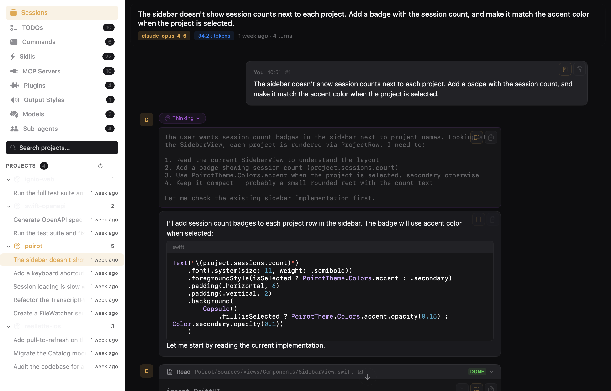
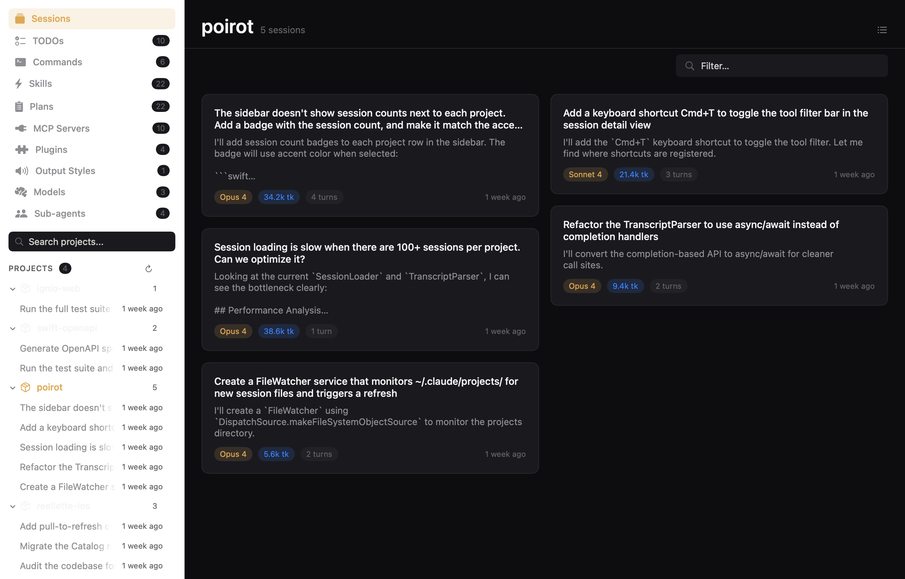
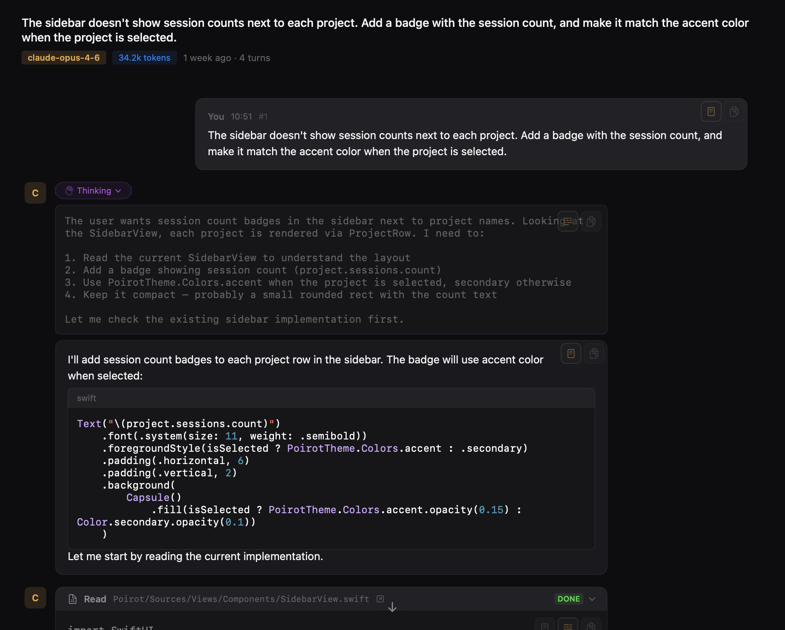
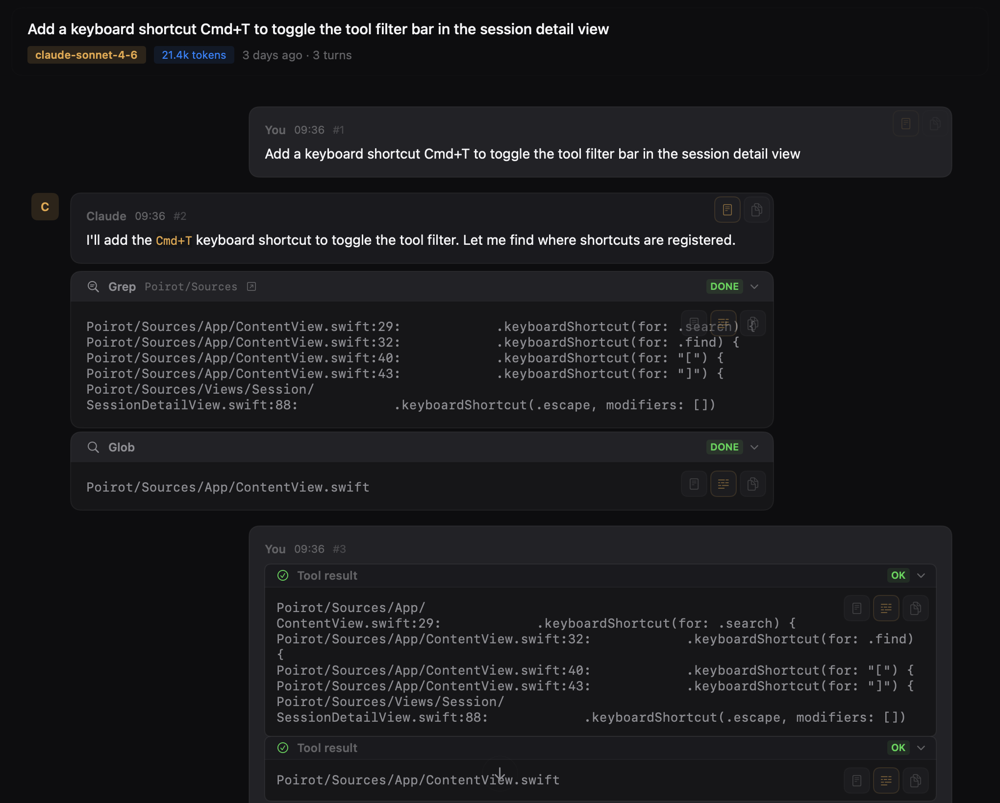
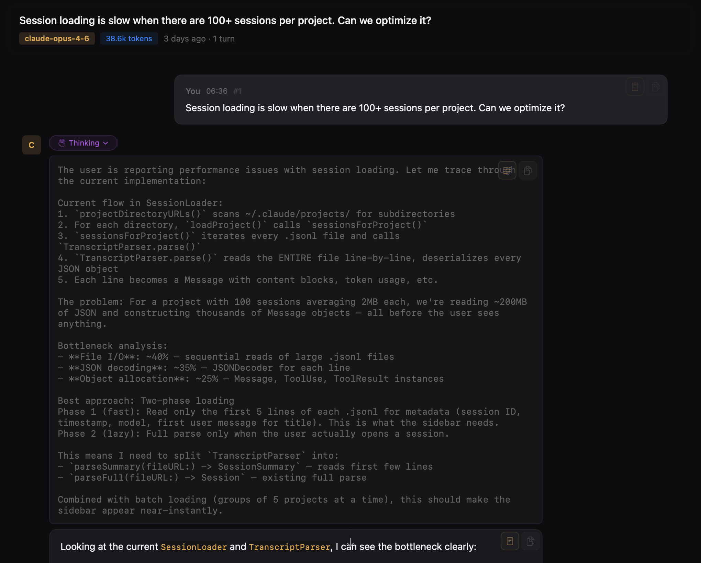
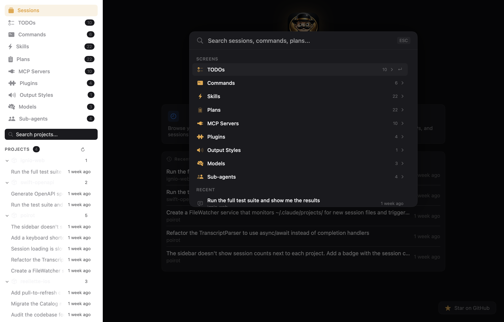
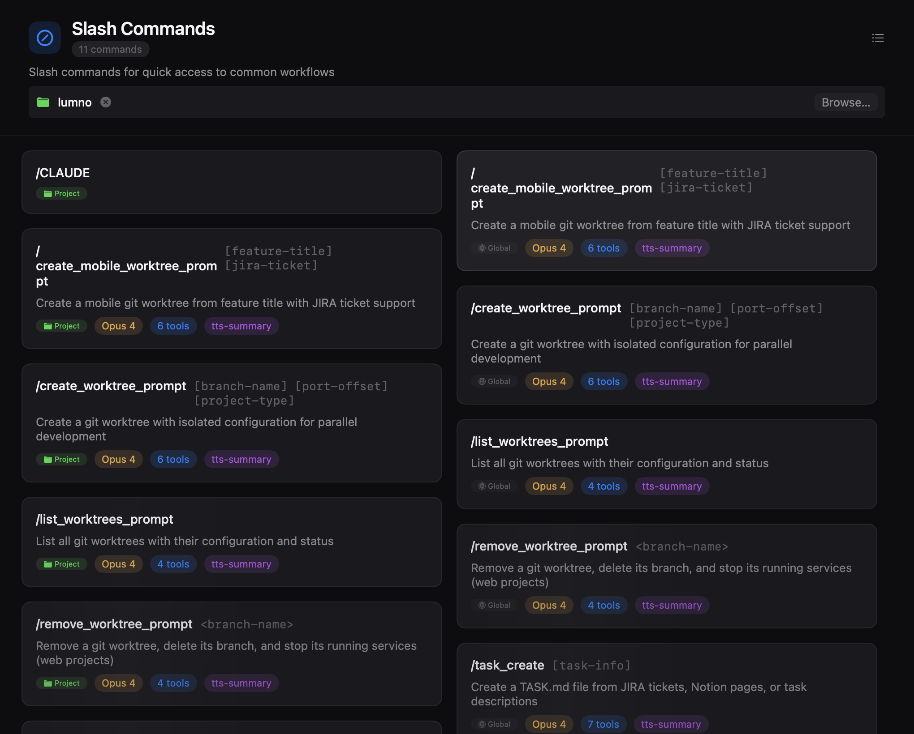
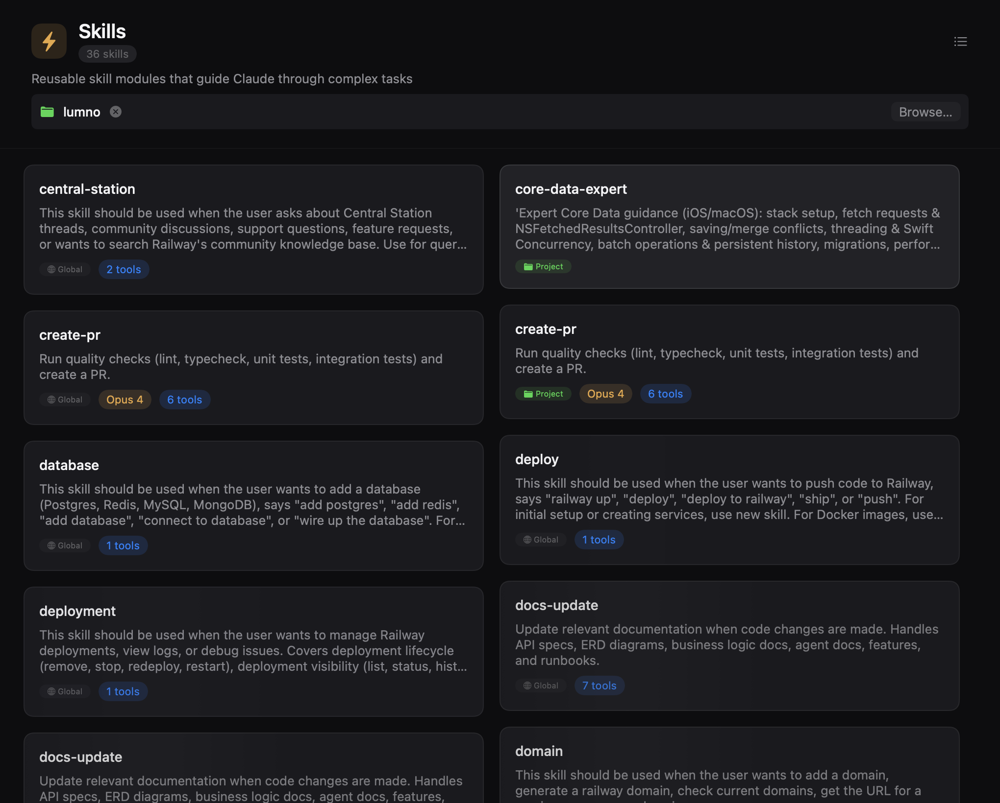
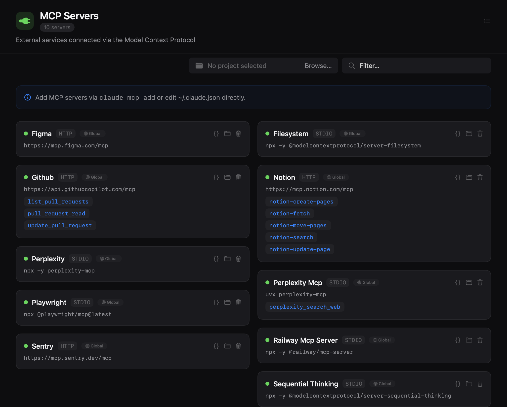

<p align="center">
  
</p>

<h1 align="center">POIROT</h1>

<p align="center">
  <strong>Investigating your Claude Code sessions.</strong><br/>
  A native macOS companion that lets you browse sessions, explore diffs, and re-run commands — all from a polished SwiftUI interface.
</p>

<p align="center">
  <a href="#features">Features</a> &bull;
  <a href="#capabilities">Capabilities</a> &bull;
  <a href="#getting-started">Getting Started</a> &bull;
  <a href="#architecture">Architecture</a> &bull;
  <a href="#contributing">Contributing</a> &bull;
  <a href="#roadmap">Roadmap</a>
</p>

<p align="center">
  
  
  
  
</p>

---

## The Story

Poirot was **vibe-coded in a weekend**. The entire app — architecture, parser, UI, tests — was built in a single creative burst with Claude Code as the co-pilot. What started as "I wonder if I can build a companion app for Claude Code... using Claude Code" turned into a real, usable tool.

Named after **Hercule Poirot**, Agatha Christie's legendary detective. Because every great investigation needs the right tools — and Poirot helps you investigate exactly what your AI assistant has been up to.

---

## Features

### Session History Browser
Browse all your Claude Code sessions grouped by project. Timestamps, token counts, model info — everything at a glance in a sidebar you'd expect from a native macOS app.

<p align="center">
  
</p>

### Rich Conversation View
Full conversation timeline with user messages, assistant responses, and collapsible tool blocks. Markdown rendering with syntax highlighting, because raw JSONL is not fun to read.

<p align="center">
  
</p>

### Tool Block Display
Every tool invocation — Read, Edit, Bash, Write — rendered with its name, icon, file path, and result. Collapsible, copyable, and with smart truncation for long outputs.

<p align="center">
  
</p>

### Extended Thinking
See Claude's thinking process with collapsible thinking blocks, styled with a distinct purple accent so you can tell reasoning from response.

<p align="center">
  
</p>

### Fuzzy Search (&#x2318;K)
Search across all sessions, commands, and file paths. A spotlight-style overlay that gets you where you need to go.

<p align="center">
  
</p>

### Slash Commands
Browse and inspect all your slash commands — global ones from `~/.claude/commands/` and project-scoped ones from `.claude/commands/`. See descriptions, arguments, model assignments, and tool permissions at a glance.

<p align="center">
  
</p>

### Skills
Explore reusable skill modules with their full documentation. Skills are rendered with markdown frontmatter parsed into structured cards showing descriptions and references.

<p align="center">
  
</p>

### MCP Servers
See all configured Model Context Protocol servers with their connection details, tool counts, and scope badges. Quickly check which servers are available globally vs. per-project.

<p align="center">
  
</p>

---

## Capabilities

| Category | Feature | Description |
|----------|---------|-------------|
| **Sessions** | JSONL Transcript Parser | Parses `~/.claude/projects/` transcripts into structured models |
| | Session History Browser | Sessions grouped by project with timestamps, model, token counts |
| | Real-time File Watching | Auto-updates via GCD dispatch sources with 1s debounce |
| | Per-Project Configuration | Supports global (`~/.claude/`) and per-project (`.claude/`) scopes |
| | Session Detail View | Full conversation timeline with collapsible blocks and scroll-to-bottom |
| **Conversation** | Markdown Rendering | Rich text with syntax highlighting via MarkdownUI + HighlightSwift |
| | Code Diff Viewer | Syntax-highlighted inline diffs for Edit tool blocks |
| | Bash Output Renderer | Terminal command output with monospace styling and exit status |
| | Extended Thinking | Collapsible thinking blocks with distinct purple accent |
| | Tool Blocks | Every tool invocation rendered with name, icon, file path, and result |
| | In-Session Search | ⌘F to search within the current conversation |
| **Search** | Universal Search (⌘K) | Fuzzy search across sessions, commands, skills, MCP servers, plugins, output styles, models, and sub-agents |
| | Grouped Results | Results organized by category with counts |
| | Quick Access | Empty state shows shortcuts, counts, and recent sessions |
| **Configuration** | Commands | Browse and manage slash commands (global and per-project) |
| | Skills | Browse and manage reusable skill modules |
| | MCP Servers | Browse configured Model Context Protocol servers |
| | Models | Browse available models and capabilities |
| | Sub-agents | Browse custom sub-agent definitions |
| | Plugins | Browse installed plugins |
| | Output Styles | Browse and manage output style configurations |
| | Grid & List Views | Toggle between card grid and compact list layouts |
| | Scope Badges | Visual distinction between Global and Project-scoped items |
| **Integrations** | IDE/Editor | One-click open files in VS Code, Cursor, Xcode, or Zed |
| | Terminal Selection | Pick your terminal: Terminal, iTerm2, Warp, Ghostty, Kitty, Alacritty |
| | Quick Command Re-run | Click any Bash command to copy or open in your terminal |
| **Navigation** | Font Scaling | ⌘+ / ⌘- / ⌘0 to zoom the entire UI |
| | Keyboard Shortcuts | Full keyboard navigation with discoverable shortcut hints |
| | Help Book (⌘?) | Keyboard reference, feature overview, and getting started guide |
| **App** | Onboarding Flow | First-run welcome with CLI detection, session discovery, and feature tour |
| | Homebrew Distribution | `brew install --cask poirot` with automated release workflow |
| **Design** | Dark Theme | Warm golden accent (`#E8A642`) on near-black backgrounds |
| | SF Symbols | All icons are SF Symbols with bounce, pulse, and replace animations |
| | Design Tokens | Centralized `PoirotTheme` for colors, spacing, radii, and typography |
| **Architecture** | Swift 6 | Strict concurrency with `@MainActor` default isolation |
| | Observation | `@Observable` with `@State` — no `ObservableObject` |
| | Protocol-Driven DI | Services injected via SwiftUI `EnvironmentValues` |
| | Provider System | Extensible `ProviderDescribing` protocol for multi-LLM support |
| | Swift Testing | `@Test`, `#expect`, `#require` with hand-written mocks |

---

## Getting Started

### Prerequisites

| Tool | Version | Install |
|------|---------|---------|
| macOS | 15.0+ | — |
| Xcode | 16.0+ | Mac App Store |

Install SwiftLint and SwiftFormat via Homebrew: `brew install swiftlint swiftformat`.

### Build & Run

```bash
git clone https://github.com/LeonardoCardoso/Poirot.git
cd Poirot
brew install swiftlint swiftformat
open Poirot.xcodeproj
```

Hit **&#x2318;R** in Xcode and you're up. Or build from the command line:

```bash
xcodebuild -scheme Poirot -destination 'platform=macOS' -skipMacroValidation build
```

### Run Tests

```bash
xcodebuild test -scheme Poirot -destination 'platform=macOS' -skipMacroValidation
```

Tests use [Swift Testing](https://developer.apple.com/documentation/testing/) (`@Test`, `#expect`, `#require`) — not XCTest.

---

## Architecture

```
Poirot/Sources/
├── App/           # Entry point, ContentView, AppState, Settings
├── Models/        # Value-type structs — Project, Session, Message, ContentBlock
├── Protocols/     # Service protocols (SessionLoading, ProviderDescribing)
├── Services/      # Concrete implementations + SwiftUI Environment DI
│   └── Providers/ # LLM provider configs (ClaudeCodeProvider)
├── Theme/         # Design tokens (PoirotTheme) + Markdown theme
├── Utilities/     # Parsers, terminal launcher
└── Views/         # SwiftUI views organized by feature
    ├── Components/    # Sidebar, StatusBar, Shimmer
    ├── Configuration/ # Config dashboard
    ├── Home/          # Welcome / empty state
    ├── Project/       # Project sessions list
    ├── Search/        # &#x2318;K overlay
    └── Session/       # Conversation detail, tool blocks, thinking
```

### Tech Stack

| Layer | Choice |
|-------|--------|
| Language | Swift 6 with strict concurrency |
| UI | SwiftUI + Observation (`@Observable`) |
| Concurrency | `MainActor` default isolation |
| DI | Protocol-driven services via `EnvironmentValues` |
| Markdown | [MarkdownUI](https://github.com/gonzalezreal/swift-markdown-ui) |
| Syntax Highlighting | [HighlightSwift](https://github.com/nicklawls/HighlightSwift) |
| Linting | SwiftLint (strict profile) |
| Formatting | SwiftFormat |
| Project Gen | XcodeGen |
| Testing | Swift Testing with hand-written mocks |

### Design System

Poirot uses a custom dark theme built around a warm golden accent (`#E8A642`) on near-black backgrounds (`#0D0D0F`). All icons are **SF Symbols** with symbol effects (bounce, pulse, replace transitions). Typography scales dynamically with user preference (&#x2318;+/&#x2318;-).

Design tokens live in [`PoirotTheme.swift`](Poirot/Sources/Theme/PoirotTheme.swift) — colors, spacing, radii, and typography all in one place.

### How It Works

```
~/.claude/projects/          Poirot reads JSONL transcripts
        │                    from Claude Code's local storage
        ▼
┌─────────────────┐
│  SessionLoader   │──▶ Discovers projects & session files
└────────┬────────┘
         ▼
┌─────────────────┐
│ TranscriptParser │──▶ Parses JSONL into Session/Message models
└────────┬────────┘
         ▼
┌─────────────────┐
│    AppState      │──▶ Observable state with in-memory caching
└────────┬────────┘
         ▼
┌─────────────────┐
│   SwiftUI Views  │──▶ Sidebar → Session Detail → Tool Blocks
└─────────────────┘
```

---

## Contributing

We welcome contributions of all sizes — bug fixes, new features, documentation, or just fixing a typo.

### Quick Start

1. Fork the repo
2. Create a feature branch from `main`
3. Make your changes with tests
4. Ensure the build passes with zero warnings
5. Ensure all tests pass
6. Ensure SwiftLint passes
7. Open a PR against `main`

See [CONTRIBUTING.md](CONTRIBUTING.md) for the full guide on code style, architecture conventions, and testing expectations.

### Code Style at a Glance

- **Swift 6** — All types are implicitly `@MainActor` (no manual annotations needed)
- **`@Observable`** with `@State` — not `ObservableObject`
- **SF Symbols only** — No custom icon assets
- **Swift Testing** — `@Test`, `#expect`, `#require` for all new tests
- **Hand-written mocks** — In `PoirotTests/Mocks/`, no mocking frameworks

---

## Roadmap

Poirot is early. There's a lot to build and we'd love your help. Track what's planned and in progress on the [issues page](../../issues).

---

## Community

- **Found a bug?** [Open an issue](../../issues)
- **Have an idea?** [Start a discussion](../../discussions)
- **Want to contribute?** [Read the guide](CONTRIBUTING.md) and send a PR

---

## Acknowledgments

- Built with [Claude Code](https://claude.ai/code) — the tool this app is built to complement
- [MarkdownUI](https://github.com/gonzalezreal/swift-markdown-ui) for rich text rendering
- [HighlightSwift](https://github.com/nicklawls/HighlightSwift) for code syntax highlighting
- [XcodeGen](https://github.com/yonaskolb/XcodeGen) for declarative project configuration
- Every SF Symbol that made the UI feel native

---

## License

MIT — see [LICENSE](LICENSE) for details.

No tracking. No analytics. Analyze the code yourself, or ask your Claude to do it. :)

Made with coffee and Claude Code in a weekend.

<p align="center">
  <sub>If you find Poirot useful, consider giving it a star. It helps others discover the project.</sub>
</p>
